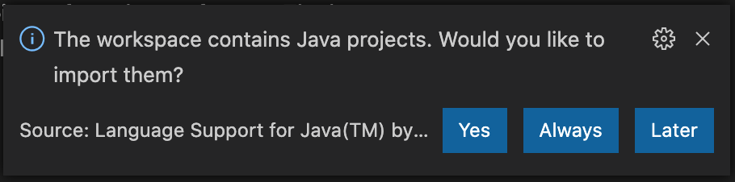
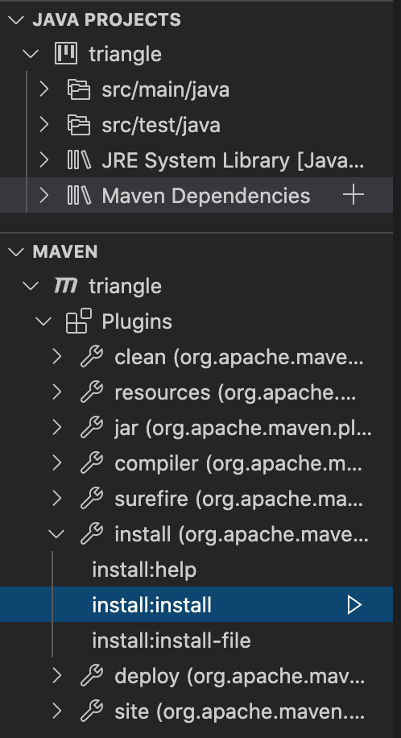
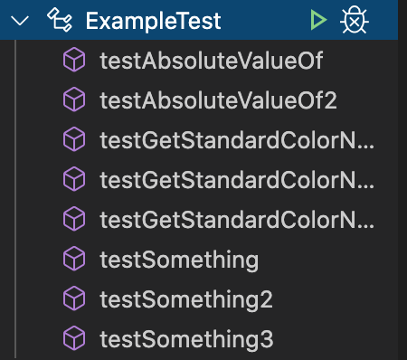

## 0. Prerequisites

* Java (Tested with OpenJDK 14)
* Maven (Tested with Maven 3.6)

## 1. Install Visual Studio Code

* Go to [Visual Studio Code Homepage](https://code.visualstudio.com/) and download the Stable Build for Mac / Windows or Linux.
* Install it
* Open Visual Studio Code

## 2. Install Live Share Extension

* Open "Extensions" Tab 
* Install "Live Share" 
* For more details see [this blog](https://code.visualstudio.com/blogs/2017/11/15/live-share)

## 3. Install Java Extension Pack

* Open "Extensions" Tab 
* Install "Java Extension Pack" 
* For more details see [this here](https://code.visualstudio.com/docs/languages/java)

## 4. Import Triangle example

* Clone Triangle Example
```
git clone git@github.com:thbde/triangle2020.git
```
* Open folder view `File > Open...`
* Import Java Project 
* Open "Explorer" Tab 
* Install Maven Dependencies 
* Open "Test" Tab 
* Execute Example Tests 

## 5. Start Live Share Session

* Open "Live Share" Tab 
* Start "Read/Write" Session
* Sign-in via Github
* Invitation link is copied to Clipboard and can be shared
* See [Marketplace](https://marketplace.visualstudio.com/items?itemName=MS-vsliveshare.vsliveshare) for more info
* You can follow/focus participants in the "Live Share" Tab 
